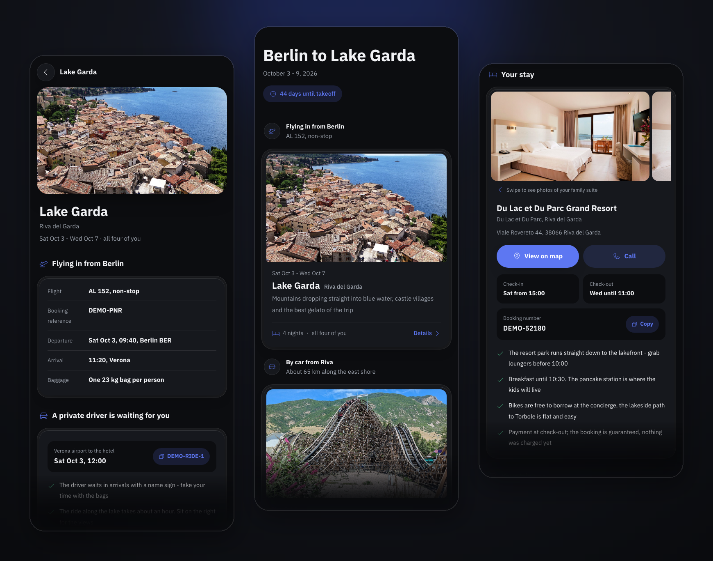
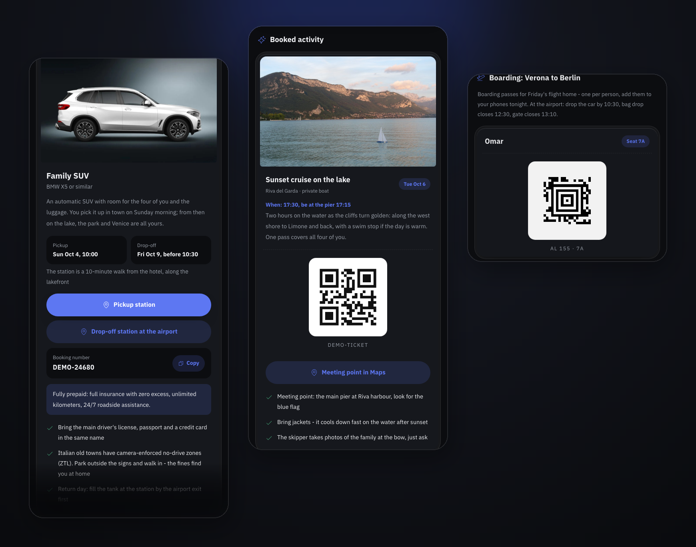

# Rihlatna

Every family trip lives in a pile of PDFs. The boarding time hides in small print on page two. The hotel's door code sits in an email from May. And at every gate, one person scrolls frantically through attachments while everyone else waits.

Rihlatna is the opposite. One app on everyone's phone: today's plan on top, every ticket one tap away, the small print already pulled out and written like a human would say it. Check-in codes, seat numbers, "be there 16:15, latecomers lose the tour". Nothing to search, nothing to miss.



You fill in one data file (or let an AI assistant do it, see below), deploy a folder, and your family gets a private, installable app behind a 4-digit PIN. It works offline in airplane mode. No backend, no accounts, no tracking.

I built the original in Arabic for my own family's vacation, and it carried the whole trip. "Rihlatna" means "our trip". This repo is that app as a template; the demo shows a made-up family on a made-up trip.

**Live demo:** [rihlatna-demo.vercel.app](https://rihlatna-demo.vercel.app/?key=1234) (PIN: `1234`)

## No coding needed

If you use an AI assistant like [Claude Code](https://claude.com/claude-code) (works with a regular Claude subscription), the whole thing is three steps:

1. Get this repo: click "Use this template", then download or clone your copy.
2. Drop all your bookings into the `bookings/` folder: flight confirmations, hotel PDFs, ticket screenshots. Any format, any language. This folder never leaves your computer.
3. Open your AI assistant in the folder and say: **"Build my trip app."**

The repo contains [instructions](CLAUDE.md) your assistant follows: it reads your bookings, fills in the trip, asks you about anything missing, helps you put the app online, and hands you the family link. It is not allowed to change the design, so your app looks exactly like the screenshots above.

## What ends up in your family's pocket



- Today's plan on the home screen, with a countdown before the trip and "you are here" during it
- Park tickets per person as scannable QR codes, plus Apple Wallet files if you have them
- Boarding passes with real Aztec barcodes (airlines don't use QR, see the notes in `trip.js`)
- Hotel cards with room photos, tap-to-call, and every booking number with a copy button
- Evening walking routes with map pins, restaurant tips, and the one emergency number that works everywhere
- Offline after the first visit, installs to the home screen like a native app
- Right-to-left support built in: set `dir: "rtl"`, translate one object, done

One honest caveat: the PIN is a convenience lock for nosy group chats, not encryption. Don't put passport scans in here.

## Rather do it yourself?

Same result without an AI assistant - you edit the data file directly:

1. Click "Use this template" (or fork).
2. Open [`js/trip.js`](js/trip.js) and describe your trip. The file is heavily commented and the demo shows every feature. Delete what you don't need: every block is optional.
3. Drop your photos into `assets/img/`.
4. Deploy the folder to Vercel or Netlify (config files included). There is no build step.
5. Send your family the link once as `https://yoursite/?key=YOURPIN`. It unlocks and remembers the device.

[](https://vercel.com/new/clone?repository-url=https%3A%2F%2Fgithub.com%2Fakado587%2Frihlatna)

One tip: if you put real tickets or booking PDFs into your copy, keep your repo private. The app works the same either way.

## How it's built

```
js/trip.js      your whole trip + every UI string (the only file you edit)
js/app.js       rendering and routing, ~750 lines of vanilla JS
css/styles.css  design system, light/dark, RTL-safe
sw.js           offline cache (bump VERSION to ship an update)
```

## Roadmap

`trip-agent`: a CLI that reads a folder of booking PDFs and writes your `trip.js` for you, with a verification pass that checks every extracted field against the source document. Bring your own API key (Anthropic, OpenAI, or local via Ollama). Not started yet.

## Credits

<details>
<summary>Demo images and third-party code</summary>

Demo photos come from Wikimedia Commons, hotels' own published marketing material and Flickr (CC), resized and stripped of metadata:

| Image | Author | License |
|---|---|---|
| Lake Garda (Malcesine) | High Contrast | CC BY 3.0 de |
| Venice (Grand Canal) | Didier Descouens | CC BY-SA 4.0 |
| Berlin | Kasa Fue | CC BY-SA 4.0 |
| Roller coaster | Jeremy Thompson | CC BY 2.0 |
| Resort rooms | Kassandra Bay Collection Hotels | CC BY 2.0 |
| Resort pool | Jeda Villa Bali | CC BY 2.0 |
| Venice hotel rooms | NH Hotels marketing material | — |
| Sunset sailboat (Lac d'Annecy) | Flickr user *_* | CC BY 2.0 |

Icons: [Phosphor](https://phosphoricons.com) (MIT). QR encoder: Kazuhiko Arase (MIT). Font: IBM Plex Sans Arabic (OFL).

</details>

## License

[MIT](LICENSE)
